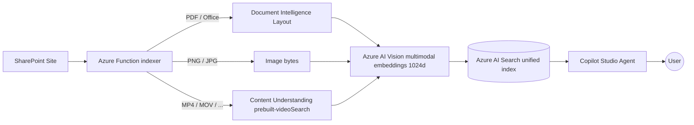

# SharePoint Multimodal RAG for Copilot Studio

A single solution that indexes **text, image, and video** files from SharePoint into one **Azure AI Search** index, so a **Microsoft Copilot Studio** agent can ground its answers across an entire SharePoint workspace — documents, slides, photos, and training videos — with per-user security trimming.

It merges two accelerators into one pipeline:

- **SharePoint Connector** — documents and images → unified multimodal (text + image) embeddings.
- **Video RAG** — videos → Azure AI Content Understanding transcripts + per-segment summaries.

Both paths produce chunks in the **same vector space** and land in the **same index**, so retrieval works seamlessly across every content type.

## How it works

The merged solution runs as a queue-fed Azure Function (Flex Consumption). For each SharePoint file it picks the right extractor by file type, then everything converges on one chunk → embed → index path:



| Content type | File types | Extractor | Output |
|--------------|-----------|-----------|--------|
| Documents | PDF, DOCX, PPTX, XLSX, TXT, MD, HTML, … | Document Intelligence Layout (optional) | Text + figure blocks |
| Images | PNG, JPG, JPEG, TIFF, BMP | Direct multimodal embedding | Image vector |
| Video | MP4, MOV, AVI, MKV, WMV, M4V, WEBM | Content Understanding `prebuilt-videoSearch` | Transcript + per-segment summary text |

All three are embedded with **Azure AI Vision multimodal** (1024-d, text + image share one space) and pushed to the same Azure AI Search index — a text query can retrieve a paragraph, a chart image, or a moment in a video.

## Repository structure

```
.
├── sharepoint-connector/   # THE merged solution (text + image + video indexer)
│   ├── content_understanding_client.py   # video -> transcript/summary blocks (merged-in)
│   ├── document_processor.py             # routes files by type, incl. video
│   ├── indexer.py                        # orchestrates extract -> chunk -> embed -> index
│   ├── infra/                            # Bicep (set enableVideoIndexing=true for video)
│   └── ...
├── video-rag/              # Original Video RAG accelerator (Logic App reference + sample videos)
├── LICENSE
├── CODE_OF_CONDUCT.md
├── SECURITY.md
└── SUPPORT.md
```

> The merged code solution lives in [sharepoint-connector](./sharepoint-connector). The [video-rag](./video-rag) folder is retained for reference (the original Logic App implementation) and for its sample test videos under [video-rag/video-samples](./video-rag/video-samples).

## Getting started

1. Follow the **[SharePoint Connector README](./sharepoint-connector/README.md)** to deploy the indexer and Azure AI Search.
2. To enable **video** indexing, deploy with `enableVideoIndexing=true` (Bicep) **or** set the `CONTENT_UNDERSTANDING_ENDPOINT` app setting to your Foundry / Azure AI Services endpoint in a [Content Understanding supported region](https://learn.microsoft.com/azure/ai-services/content-understanding/language-region-support#region-support).
3. Wire the index into your Copilot Studio agent as a knowledge source.

> Video processing reuses the same Foundry account and managed identity as the multimodal embeddings (the `Cognitive Services User` role already covers Content Understanding). No extra resource is required when the Foundry region supports Content Understanding.

## License

See [LICENSE](./LICENSE). Security and support guidance are in [SECURITY.md](./SECURITY.md) and [SUPPORT.md](./SUPPORT.md).
