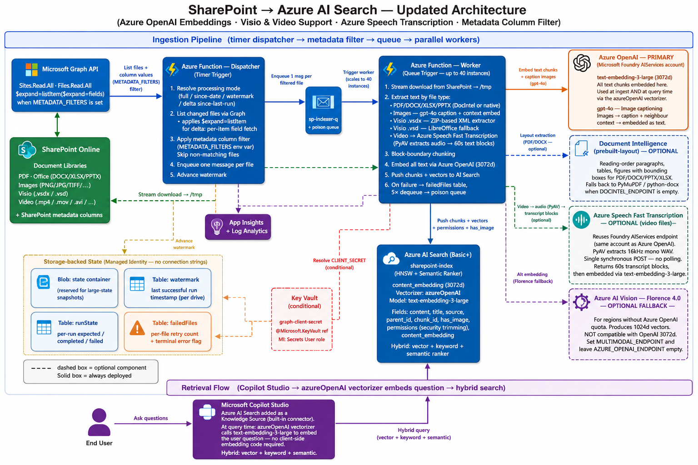

# SharePoint → Azure AI Search Connector

A production-oriented push connector that keeps an Azure AI Search index in sync with one (or a subset of) SharePoint site  so a Microsoft Copilot Studio agent can ground its answers on up-to-date enterprise content while honouring each user's access rights.

This accelerator aims to overcome the [SharePoint knowledge source](https://learn.microsoft.com/en-us/microsoft-copilot-studio/knowledge-add-sharepoint) option [limitations](https://learn.microsoft.com/en-us/microsoft-copilot-studio/requirements-quotas#sharepoint-web-app-limits) on file size (over 200MB), multi-modal indexing, and metadata-driven content filtering.

## Table of Contents

- [Objective](#objective)
- [Features](#features)
- [Architecture Diagram](#architecture-diagram)
- [Getting Started](#getting-started)
  - [Video Walkthrough](#video-walkthrough)
  - [Prerequisites](#prerequisites)
  - [Deployment Options](#deployment-options)
    - [Automated Deployment](#automated-deployment)
    - [Manual Deployment](#manual-deployment)
- [Testing the Solution](#testing-the-solution)
- [Extension Guide](#extension-guide)
  - [Extending with Per-User Security Trimming](#extending-with-per-user-security-trimming)
  - [Add a New File Format](#add-a-new-file-format)
  - [Change the Embedding Model](#change-the-embedding-model)
  - [Switch Between Processing Modes](#switch-between-processing-modes)
  - [Adjust Concurrency](#adjust-concurrency)
  - [Change the Search Index Schema](#change-the-search-index-schema)
- [Troubleshooting](#troubleshooting)
- [Appendix](#appendix)
  - [Key Requirements](#key-requirements)
  - [Assumptions](#assumptions)
  - [Project Structure](#project-structure)
  - [How the Pipeline Works](#how-the-pipeline-works)
  - [Addressing Well-Architected H/M Risks](#addressing-well-architected-hm-risks)
  - [Useful Resources](#useful-resources)
  - [In this repository](#in-this-repository)
---

## Objective

Ship a push-model SharePoint → Azure AI Search connector that a Copilot Studio agent can query over a **unified multimodal index** (text + image content in the same vector space), from a **well-defined subset** of a SharePoint site, with **deletion propagation**, **nightly backups**, and **least-privilege Graph access** — all running as a serverless Azure Function.

Azure AI Search's [SharePoint connector (preview)](https://docs.azure.cn/en-us/search/search-howto-index-sharepoint-online) has real limitations: no private endpoint support, no Conditional Access compatibility, no SLA, and limited control over the extraction pipeline. This accelerator is a worked example of how to build a custom push pipeline that gives you all of that control while still using the latest Azure services under the hood (Azure OpenAI `text-embedding-3-large` embeddings + `gpt-4o` image captioning, Document Intelligence Layout, Copilot Studio's built-in generative orchestration).

---

## Features

Use cases this accelerator is designed to enable:

1. **Grounded Copilot Studio agents over SharePoint content.** A generative-orchestration agent answers employee questions using the most recent SharePoint documents, with citations back to the source files.
2. **Multimodal retrieval.** Text queries find images too. A question about "our Q3 revenue chart" surfaces the slide containing the chart, not just text that mentions Q3.
3. **Visio diagram search.** Visio files (`.vsdx`, and `.vsd` when LibreOffice is available) have their on-canvas shape and stencil labels extracted with the Python standard library (no third-party package), so flowcharts and network diagrams become searchable by their labels alongside other documents.
4. **Scoped monitoring.** Point the indexer at a specific site OR a specific folder within a site's library, so one connector instance watches one team's content without touching the rest of the tenant.
5. **Near-real-time deletion propagation.** When a file is deleted in SharePoint, its chunks leave the index on the next indexer run — no manual cleanup.

6. **Metadata column filter.** Set `METADATA_FILTERS=DocumentStatusTX=Approved` (comma-separated `column=value` pairs; AND logic; case-insensitive) so only files whose SharePoint column values match are dispatched for indexing. Files that don't match are skipped before any download, embedding, or index write. Works in both full-listing and delta modes. Useful for libraries that use approval workflows — only publish content that has been formally approved.

7. **Video transcription.** Video files (`.mp4`, `.mov`, `.avi`, `.mkv`, `.wmv`, `.m4v`, `.webm`) are transcribed via **Azure Speech Fast Transcription API** using the same Foundry AIServices account as Azure OpenAI — no separate resource needed, and available in Canada Central. [PyAV](https://pyav.org/) extracts a 16 kHz mono WAV from the video in-memory; a single synchronous POST returns timestamped phrase-level results, which are grouped into `~60 s` text blocks with `[MM:SS–MM:SS]` timestamps and embedded alongside documents.

Additional feature extensions like **Per-user security trimming** are shared under [Extension Guide](#extension-guide).

---

## Architecture Diagram



Editable source (open in [draw.io](https://app.diagrams.net) or the VS Code Draw.io extension):
- [images/sharepoint-connector-architecture-updated.drawio](images/sharepoint-connector-architecture-updated.drawio) — **current** diagram reflecting Azure OpenAI embeddings, Visio support, Azure Speech Fast Transcription for video, and the Metadata Column Filter.

**Flow at a glance (default deployment).** The dispatcher (timer) asks SharePoint (via Graph `/delta`) what's changed, applies the configured **metadata column filter** (`METADATA_FILTERS`), enqueues one message per matching file onto Storage Queue, and advances the per-drive delta token. Queue workers scale out: each pulls a message, streams the file to tempfile, routes by file type — Visio `.vsdx` files through a ZIP-based XML extractor (`.vsd` via LibreOffice), documents through Document Intelligence Layout (if enabled) or the fallback extractors, standalone images captioned by **`gpt-4o`**, video files transcribed by **Azure Speech Fast Transcription** (PyAV extracts audio in-memory; a single synchronous REST call returns timestamped transcripts, grouped into `~60 s` blocks) — all text chunks are then embedded via **Azure OpenAI `text-embedding-3-large` (3072d)**, image crops uploaded to blob for citation thumbnails, and chunks (with `permission_ids`) pushed into the AI Search index. A Copilot Studio agent then queries that index directly via the **built-in Azure AI Search Knowledge Source** connector — the registered `azureOpenAI` vectorizer embeds queries server-side using `text-embedding-3-large` — vector + keyword + semantic ranker, no client-side embedding code — and grounds its responses on the retrieved chunks.

> **Per-user security trimming is NOT enabled by default.** Every authenticated user of the agent sees every chunk in the index. To enforce SharePoint ACLs at query time (so users only see citations from documents they actually have access to), follow **[Extending with Per-User Security Trimming](#extending-with-per-user-security-trimming)** at the end of this document — that opt-in adds an `/api/search` Function App endpoint, an Entra app registration, and a Power Platform connection, and replaces the direct AI Search → Copilot Studio link with an HTTP action that flows the signed-in user's delegated token.

---

## Getting Started

### Video Walkthrough

A ~9 minute end-to-end walkthrough — architecture, deployment, post-deployment configuration, and a smoke test against a real SharePoint site. 

https://github.com/user-attachments/assets/bd42ea55-6cf8-4e6d-99e1-8a5eb33a6fd4

### Prerequisites

Everything below is needed for the **default deployment** (Copilot Studio queries Azure AI Search directly — no per-user security trimming). The opt-in extension adds further prerequisites; those are listed in [Extending with Per-User Security Trimming](#extending-with-per-user-security-trimming).

**You provide:**

- A **SharePoint Online site** with the content you want indexed.
- A **SharePoint Administrator** (or Global Administrator) account to run the `Sites.Selected` per-site grant once after deployment.
- An **Azure subscription** where you hold **Owner** (or *Contributor + User Access Administrator*) on the target resource group — the template assigns RBAC roles on the resources it creates.
- A **Copilot Studio** environment with the *environment maker* role to add the AI Search index as a Knowledge Source on your agent.

**Workstation tools:**

- [Azure CLI](https://learn.microsoft.com/cli/azure/install-azure-cli) (`az`) — runs the Bicep deployment.
- [PowerShell 7+](https://learn.microsoft.com/powershell/scripting/install/installing-powershell-on-windows) — required by `infra/deploy.ps1` and the Sites.Selected helper (Windows PowerShell 5.x will not work).

No local Python, `uv`, or `func` CLI needed — the function code is pulled from a GitHub Release by the deployment itself.

#### What the template creates

Storage Account (with queue / table / blob containers), Log Analytics + Application Insights, **Azure AI Search (Basic)**, **Microsoft Foundry / Azure AI Services** multi-service (hosts **Azure OpenAI `text-embedding-3-large`** embeddings + **`gpt-4o`** image captioning model deployments + **Azure Speech Fast Transcription** for video files — all three share the same endpoint and managed-identity RBAC role), **Document Intelligence** (Layout), **Key Vault**, Flex Consumption plan, and the Function App — plus every RBAC assignment on the Function's managed identity. No "pre-existing resource" paste-in.

In addition, the template **always** creates a tiny dedicated storage account named `<baseName>ds<hash>` (suffix `ds` = "deployment scripts"), tagged `purpose=arm-deployment-scripts`, with `allowSharedKeyAccess: true`. The two ARM `deploymentScripts` (`createSearchIndex`, `publishCode`) need a key-enabled storage account to upload their script payload — without this, deployment fails with `KeyBasedAuthenticationNotPermitted` in tenants that enforce the *"Storage accounts should prevent shared key access"* Azure Policy. If your tenant has that policy in Deny mode, add a single **policy exemption** scoped to resources matching `tags['purpose'] == 'arm-deployment-scripts'` (or scope the exemption to this one resource by name). The application data path (the main storage account, BYO or template-created) does **not** rely on shared keys — only this small `*ds*` account does.

#### Bring your own storage (BYO)

Set `existingStorageAccountResourceId` to a full ARM resource ID to skip creating the main storage account. Use this when:

- Tenant policy forbids creating new general-purpose storage accounts.
- You need the data plane in a specific RG / VNet / encryption-key boundary.
- You want to keep ownership of the storage lifecycle separate from the Function App.

**Prerequisites — the BYO storage account MUST already contain these child resources** (the template will not create them on a BYO account):

| Kind | Names |
|---|---|
| Blob containers | `app-package`, `state`, `images`, `backup` |
| Queues | `sp-indexer-q`, `sp-indexer-q-poison` |
| Tables | `failedFiles`, `runState`, `watermark` |

**RBAC on the BYO storage account's resource group** — the deployer principal needs `User Access Administrator` (or `Owner`) on the BYO storage account's RG, because the template creates four cross-RG role assignments on the Function App's managed identity (`Storage Blob Data Owner`, `Storage Account Contributor`, `Storage Queue Data Contributor`, `Storage Table Data Contributor`). These are deployed via a small `byo-storage-roles.bicep` module scoped to that RG.

### Deployment Options

The template asks for **two values** — everything else is inferred, defaulted, or created by the deployment itself.

| Parameter | Required? | What it is |
|---|---|---|
| `baseName` | ✅ | Resource-name prefix (3–16 chars). **Lowercase a–z, 0–9, hyphens only** — no spaces, underscores, dots, or uppercase. The template fails fast (synthetic resource names containing `INVALID-baseName-…`) if any disallowed character is present. A uniqueness hash is appended for globally-unique resources. |
| `sharePointSiteUrl` | ✅ | Full URL of the SharePoint site to monitor. |
| `location` | optional | Azure region (default `resourceGroup().location`). Azure OpenAI (`text-embedding-3-large` / `gpt-4o`) is available in Canada Central and most Azure regions — check [Microsoft Learn](https://learn.microsoft.com/en-us/azure/ai-services/openai/concepts/models) for the latest availability. |
| `enableSecurityTrimming` | optional | **Default `false`** — Copilot Studio queries AI Search directly. Flip to `true` only as part of the [Extending with Per-User Security Trimming](#extending-with-per-user-security-trimming) walkthrough. |
| `speechLocale` | optional | BCP-47 locale for Azure Speech video transcription (default `en-US`). Adjust to the primary spoken language in your video content (e.g. `fr-FR`, `es-ES`). Video files are always included in `INDEXED_EXTENSIONS`; remove the video extensions from that app setting post-deploy to disable video indexing entirely. |
| `apiAudience` | optional | Used **only** when `enableSecurityTrimming = true`. Supply a pre-created Entra app clientId (GUID or `api://<guid>`) when the deployer lacks `Application Administrator`; leave empty otherwise. |
| `existingStorageAccountResourceId` | optional | **Bring-your-own (BYO) storage.** Empty (default) = template creates a new storage account. Supply the full ARM resource ID (`/subscriptions/<sub>/resourceGroups/<rg>/providers/Microsoft.Storage/storageAccounts/<name>`) to reuse an existing storage account — useful in tenants whose Azure Policy forbids creating new storage accounts. See [Bring your own storage](#bring-your-own-storage-byo) below for prerequisites. |

Handled by the template itself:

- **Tenant ID** comes from the deployment context (`subscription().tenantId`).
- **Function-app package URL** is hardcoded to the latest GitHub Release (`sharepoint-connector-latest`); edit `main.bicep` directly if you want to point at a fork.

#### Automated Deployment

[](https://portal.azure.com/#create/Microsoft.Template/uri/https%3A%2F%2Fraw.githubusercontent.com%2Fgokseloral%2Fsick-kids-ppdocs%2Fmaster%2Fsharepoint-connector%2Fdeploy%2Fazuredeploy.json)

Clicking the button opens the Azure portal's custom-deployment form. Fill in the two required values (`baseName`, `sharePointSiteUrl`) — leave the rest at their defaults. The template provisions **everything** — Storage Account (+ queue / table / containers), Log Analytics + App Insights, Azure AI Search (Basic), Microsoft Foundry / Azure AI Services multi-service (hosts Azure OpenAI `text-embedding-3-large` + `gpt-4o` model deployments), Document Intelligence (Layout), Key Vault, Flex Consumption plan + Function App, and every RBAC assignment on the Function's managed identity. It also **pulls the latest CI-built function-app package** from GitHub Releases (`sharepoint-connector-latest`) via an ARM `deploymentScript` and writes it to the Function App's storage container — so the code is already running when the deployment finishes. No `func publish` step.

After the ARM deployment succeeds, four manual steps remain — all can be completed by an admin in under 15 minutes. Steps 1, 2 and 3 are **all required** for the Function App's managed identity to actually read your SharePoint site AND download document content (skipping any one yields a `401` or `403` from Microsoft Graph at indexer-run time — see Troubleshooting **S6**).

> **One-time pre-requisite for steps 1, 2 and 3** — install [PowerShell 7+](https://learn.microsoft.com/powershell/scripting/install/installing-powershell-on-windows). The Microsoft Graph PowerShell SDK these scripts use **does not work on Windows PowerShell 5.x**.
> ```powershell
> winget install --id Microsoft.PowerShell --source winget
> ```
> Open a `pwsh` window (not `powershell`) for the commands below. On first run each script auto-installs `Microsoft.Graph.Authentication` + `Microsoft.Graph.Applications` in the CurrentUser scope (~30 s, ~25 MB) and prompts you to consent to the required Graph scopes in the browser; re-runs reuse the cached token.

1. **Grant `Sites.Selected` tenant-level Graph permission to the Function's managed identity.** Without this the MI cannot call any `/sites/...` endpoint on Microsoft Graph (every call returns `401 Unauthorized`). This is a **tenant-level Graph application-permission assignment** to the MI's enterprise application — it does NOT yet pick which SharePoint site is reachable; that's step 2.

   **Who can run this:** the signed-in user must hold one of:
   - **Cloud Application Administrator** (recommended — least privilege), **or**
   - **Privileged Role Administrator**, **or**
   - **Global Administrator**.

   The role is needed because the script calls `New-MgServicePrincipalAppRoleAssignment`, which requires the delegated Graph scope `AppRoleAssignment.ReadWrite.All`.

   ```powershell
   .\infra\grant-graph-permission.ps1 `
       -FunctionAppName "<function-app-name>" `
       -Permission "Sites.Selected"
   ```

2. **Grant the Function's MI READ access to your specific SharePoint site.** Whitelists the one site the indexer is allowed to see (least-privilege per-site grant — the `Sites.Selected` model). Required even after step 1 — without it the MI gets `403 Forbidden` instead of `401`.

   **Who can run this:** the signed-in user must hold one of:
   - **SharePoint Administrator** (recommended — least privilege), **or**
   - **Global Administrator**.

   The role is needed because the script calls `POST /sites/{id}/permissions`, which requires the delegated Graph scope `Sites.FullControl.All` — a scope the Azure CLI's first-party token does not carry, hence the dedicated Microsoft Graph PowerShell SDK script.

   ```powershell
   .\infra\grant-site-permission.ps1 `
       -SiteUrl "https://contoso.sharepoint.com/sites/YourSite" `
       -FunctionAppName "<function-app-name>"
   ```

   > **Tip:** if the same admin holds both Cloud Application Administrator AND SharePoint Administrator, run steps 1 and 2 back-to-back in the same `pwsh` session — the cached Graph token will be reused for the second `Connect-MgGraph` call (it'll just request the additional scope incrementally, no second browser sign-in needed).

3. **Grant the Function's MI `Files.Read.All` Graph application permission.** Required for the worker's *file-content download* path (`GET /drives/{id}/items/{id}/content`). The `Sites.Selected` + per-site grant from steps 1 and 2 covers site/drive *enumeration*, but content downloads on Microsoft Graph are gated by a separate authorization check that — in many tenants, especially with Conditional Access or app-protection policies enabled — does not consistently honour `Sites.Selected` for managed identities. Symptom if skipped: dispatcher succeeds, but every worker logs `Download transient error: Client error '401 Unauthorized'` against `/drives/.../items/.../content` and files never land in the index.

   **Who can run this:** same role as step 1 — **Cloud Application Administrator** (recommended), **Privileged Role Administrator**, or **Global Administrator**.

   ```powershell
   .\infra\grant-graph-permission.ps1 `
       -FunctionAppName "<function-app-name>" `
       -Permission "Files.Read.All"
   ```

   > **Security note:** `Files.Read.All` is a tenant-wide read on all SharePoint and OneDrive files. The per-site grant from step 2 still scopes which sites the *indexer code* enumerates, but the underlying token will technically be able to read any file the MI is asked to fetch. If your security-review process forbids `Files.Read.All`, see Troubleshooting **S6** for the strict `Sites.Selected`-only flow and the additional tenant-level configuration it requires.

4. **Add Azure AI Search as a Knowledge Source on your Copilot Studio agent.** Built-in connector — no Entra app registration, no Power Platform connection, no topic YAML to import. The Bicep deployment provisioned the index schema before exiting, so Copilot Studio's wizard sees the vector index immediately. **Requires the Copilot Studio environment maker role.**

   - Open the agent in **Copilot Studio → Knowledge → + Add knowledge → Azure AI Search**.
   - Fill in:
     - **Search service** — pick the search service the deployment created (`<baseName>-search-<hash>`).
     - **Index name** — `sharepoint-index`.
     - **Authentication** — choose **Managed identity** if your Copilot Studio environment supports it, then grant the environment's identity the **Search Index Data Reader** role on the search service. Otherwise pick **API key** and paste a query key from **Azure Portal → Search service → Keys → Query keys**.
     - **Semantic configuration** — `sp-semantic-config`.
     - **Vector field** — `content_embedding` (the index has a registered `azureOpenAI` vectorizer pointing at the deployed `text-embedding-3-large` model, so Copilot Studio queries are vectorised server-side — no client-side embedding code). Dimension: **3072**.
   - **Title field** — `title`. **URL field** — `source_url`. **Content field** — `content_text`. (Field names are defined in [infra/sharepoint-index.json](infra/sharepoint-index.json).)
   - Click **Add** and **Publish** the agent.

   The agent will now retrieve grounded chunks (text + image descriptions) directly from the index using vector + keyword + semantic ranker. **Caveat:** this default flow has *no per-user security trimming* — every authenticated user of the agent sees every chunk in the index. If your library contains content with mixed audiences, see **[Extending with Per-User Security Trimming](#extending-with-per-user-security-trimming)** before you publish.

Wait 2–10 minutes for RBAC propagation, then let the hourly indexer timer fire (or trigger manually) so documents start landing in the pre-provisioned index.

> **Hit a snag during deploy?** Most Flex Consumption / RBAC / package-encoding gotchas are now baked into the Bicep template, but if you forked an older copy or are deploying into a tenant with unusual constraints, see **[Troubleshooting](#troubleshooting)** at the end of this document — the symptom matrix (S1–S10) covers every issue we hit while productionising this accelerator and gives a one-shot remediation for each. The most common one is **"Functions blade is empty after deploy"** — the fix is the **[Manual function-app deploy with `func` (fallback)](#manual-function-app-deploy-with-func-fallback)** below.

#### Manual function-app deploy with `func` (fallback)

Use this when you've successfully run `deploy.ps1` (or the **Deploy to Azure** button) but the Function App's **Functions** blade is empty. The Bicep template creates every surrounding resource (Storage, AI Search + index, Foundry, Document Intelligence, Key Vault, App Insights, role assignments, app settings) correctly — only the function-code package needs to be re-pushed via Azure Functions Core Tools.

**Prerequisites** (one-time on your workstation):

- **Azure Functions Core Tools v4** (`>= 4.0.5571` for Flex Consumption):
  ```powershell
  winget install Microsoft.Azure.FunctionsCoreTools
  func --version
  ```
- **Python 3.11** — install from python.org (Windows Store version also works). Confirm with `py -3.11 --version`.
- **Azure CLI** signed in to the same tenant as the Function App.

**Deploy:**

```powershell
# Use whatever names match your deployment
$rg = "<your-rg>"
$fn = "<function-app-name>"   # e.g. spindex-func-uqpqnf — the deploy.ps1 output prints it

cd sharepoint-connector

func azure functionapp publish $fn --python --build local
```

Core Tools handles dep installation, packaging into `.python_packages/lib/site-packages/`, upload to the Flex deploy storage, and the post-deploy sync-triggers call that the blob-only path skips. After ~1–3 minutes you should see:

```
Functions in <function-app-name>:
    sp_indexer_timer  - [timerTrigger]
    sp_dispatcher     - [timerTrigger]
    sp_worker         - [queueTrigger]
    sp_poison_handler - [queueTrigger]
    sp_backup_timer   - [timerTrigger]
    sp_backup_manual  - [httpTrigger]
```

Verify in the portal — the Functions blade now lists them — or via:

```powershell
$key = az functionapp keys list --name $fn --resource-group $rg --query masterKey -o tsv
Invoke-RestMethod -Uri "https://$fn.azurewebsites.net/admin/functions?code=$key"
```

**Why this works when blob-upload doesn't:** `func azure functionapp publish` uses Flex's deploy API endpoint (not the raw blob mount), which triggers a full worker recreate and runs the post-deploy sync-triggers handshake. The Bicep `deploymentScript` only writes the blob — Flex is then expected to discover it on its own pull cycle, which sometimes never fires without a real provisioning event. The `func` route is also the one Microsoft's docs and VS Code Azure Functions extension use under the hood.

#### Manual Deployment

Preferred when you need to review or customise each step.

1. **Clone the repo** (no local Python setup needed — the function code is pulled from a GitHub Release at deploy time):
   ```bash
   git clone <repo-url>
   cd sharepoint-connector
   ```
2. **Copy the sample parameter file**, then fill in the two required values:
   ```powershell
   Copy-Item infra/main.bicepparam.sample infra/main.bicepparam
   # Edit infra/main.bicepparam with your baseName and sharePointSiteUrl.
   ```
3. **Run the deploy script** — creates the RG if needed, runs the Bicep, and seeds the function-app package from `sharepoint-connector-latest` automatically:
   ```powershell
   .\infra\deploy.ps1 -ResourceGroup my-rg
   ```
4. **Grant `Sites.Selected` to the Function's MI** (see Automated Deployment step 1 — `grant-graph-permission.ps1`).
5. **Grant the MI READ on your specific site** (see Automated Deployment step 2 — `grant-site-permission.ps1`).
6. **Grant `Files.Read.All` to the Function's MI** (see Automated Deployment step 3 — `grant-graph-permission.ps1`).
7. **Add the AI Search index as a Knowledge Source** in Copilot Studio (see Automated Deployment step 4).

**Fork / custom-code users** — the template's `packageReleaseUrl` (defined as a `var` near the top of [infra/main.bicep](infra/main.bicep)) points at this repo's `sharepoint-connector-latest` GitHub Release. If you're deploying from a fork with code changes, let the `Release SharePoint Connector` GitHub Actions workflow run in your fork (it republishes the same tag against your fork's commits) and edit the `packageReleaseUrl` line in your local `main.bicep` to point at your fork.

**Pushing new code after the initial deploy** — merge to `main`, wait for the `Release SharePoint Connector` Action to republish `sharepoint-connector-latest`, then restart the Function App so it re-pulls from blob:

```powershell
az functionapp restart --name <function-app-name> --resource-group <rg>
```

#### Post-deployment tuning (no redeploy needed)

Every operational knob lives as an **app setting** on the Function App — change one via `az functionapp config appsettings set` and the next dispatcher / worker run picks it up. Common adjustments:

| Setting | Default | When to change |
|---|---|---|
| `SHAREPOINT_LIBRARIES` | *(all)* | Restrict to specific document-library display names. |
| `SHAREPOINT_ROOT_PATHS` | *(whole library)* | Restrict to folders inside a library. |
| `METADATA_FILTERS` | *(empty — no filter)* | Comma-separated `column=value` pairs (AND logic, case-insensitive). Only files whose SharePoint column values all match are dispatched. Example: `DocumentStatusTX=Approved`. |
| `PROCESSING_MODE` | `since-last-run` | `full` for cleanup; `since-date` + `START_DATE` for historical backfills. |
| `VECTORISE_CONCURRENCY` / `MULTIMODAL_MAX_IN_FLIGHT` | `8` / `8` | Raise for faster initial bulk loads (subject to Azure OpenAI TPM quota). |
| `AZURE_OPENAI_EMBEDDING_MODEL` | `text-embedding-3-large` | Override if you deploy under a different deployment name. |
| `AZURE_OPENAI_VISION_MODEL` | `gpt-4o` | Override if you deploy under a different deployment name. Set empty to skip image captioning (images will be indexed only if neighbour text is available). |
| `SPEECH_LOCALE` | `en-US` | BCP-47 locale for Azure Speech Fast Transcription. Change to match the primary spoken language of your video content. Video files are skipped if the video extensions are removed from `INDEXED_EXTENSIONS`. |
| `BACKUP_SCHEDULE` / `BACKUP_RETENTION_DAYS` | `0 0 3 * * *` / `7` | Adjust nightly backup cadence + retention. |

> **Schema-changing settings are not in this table.** The index schema (fields, vector profile, semantic config) lives in [infra/sharepoint-index.json](infra/sharepoint-index.json) and is provisioned by the Bicep deployment. Edit the JSON and re-run `deploy.ps1` — there is no longer an app-setting flag for index recreate.

See the **[Extension Guide](#extension-guide)** for the complete list + recipes.

## Testing the Solution

### Sample test data

If you don't have representative SharePoint content yet, Microsoft publishes a public corpus you can upload to your test site to exercise the pipeline end-to-end:

- **[Azure-Samples / azure-search-sample-data](https://github.com/Azure-Samples/azure-search-sample-data)** — mixed PDFs, DOCX, HTML, JSON, and image files covering real retrieval scenarios (healthcare PDFs, financial reports, hotel descriptions, NASA earth-at-night imagery, etc.). Drop any of these folders into the SharePoint document library the connector is pointing at and they'll flow through the full pipeline (text extraction, image captioning via Azure OpenAI `gpt-4o`, embedding via `text-embedding-3-large`, permission-filtered retrieval).

Recommended starter set for a quick smoke test:

| Folder in the repo | Why it's useful here |
|---|---|
| `health-plan/` | Small set of short PDFs — fast to ingest, exercises Document Intelligence Layout. |
| `hotel-reviews-images/` | Standalone JPGs — exercises `gpt-4o` image captioning + `text-embedding-3-large` embedding and the `content_path` / image-citation flow. |
| `nasa-e-book/` | Large-ish PDF with embedded figures — exercises Layout's figure extraction + neighbour-text chunking. |
| `hotels/` | JSON/HTML — exercises the plain-text path (extractors that bypass DocIntel). |

Upload via the SharePoint UI or [Add-PnPFile](https://pnp.github.io/powershell/cmdlets/Add-PnPFile.html) / `m365 spo file add` for scripted ingestion.

### 1. Trigger a one-off run

```powershell
$masterKey = (az functionapp keys list --name <function-app-name> --resource-group <rg> --query "masterKey" -o tsv)
Invoke-WebRequest -Uri "https://<function-app-name>.azurewebsites.net/admin/functions/sp_indexer_timer" `
    -Method POST `
    -Headers @{"x-functions-key"=$masterKey; "Content-Type"="application/json"} `
    -Body '{}'
```

Watch logs:

```bash
func azure functionapp logstream <function-app-name>
```

You should see the dispatcher log delta-query output, enqueue messages, and workers process them in parallel.

### 2. Confirm documents landed in the index

```powershell
$token = (az account get-access-token --resource "https://search.azure.com" | ConvertFrom-Json).accessToken
Invoke-RestMethod -Uri "https://<search>.search.windows.net/indexes/sharepoint-index/docs?api-version=2024-07-01&search=*&`$count=true&`$top=0" `
    -Headers @{"Authorization"="Bearer $token"}
```

Expect `@odata.count > 0`.

### 3. Test `/api/search` directly with a user token

```bash
TOKEN=$(az account get-access-token --resource api://<api-client-id> --query accessToken -o tsv)

curl -X POST "https://<function-app-name>.azurewebsites.net/api/search" \
  -H "Authorization: Bearer $TOKEN" \
  -H "Content-Type: application/json" \
  -d '{"query": "quarterly results", "top": 5}'
```

### 4. Verify deletion propagation

1. Delete a file in SharePoint (one that you've confirmed is indexed).
2. Trigger the dispatcher manually (or wait for the next schedule).
3. Run the `/indexes/.../docs/search` query from step 3 and confirm the deleted file's citations have disappeared.

### 5. Trigger a backup on demand

```powershell
$functionKey = (az functionapp keys list --name <function-app-name> --resource-group <rg> --query "functionKeys.default" -o tsv)
Invoke-WebRequest -Uri "https://<function-app-name>.azurewebsites.net/api/backup?code=$functionKey" -Method POST
```

Check the `backup` container in the storage account — you should see a `YYYY-MM-DD/` folder with `index-schema.json`, `documents.jsonl`, `watermarks.jsonl`, and `failed-files.jsonl`.

### 6. Run the unit tests locally

```bash
uv sync --extra dev
uv run pytest tests/ -v
```

The suite covers config loading, all extractors (PDF / DOCX / PPTX / XLSX / plain-text), block-aware chunking, DocIntel-result-to-block mapping, the multimodal embeddings client (including the bounded-concurrency and 429 cool-off paths), the security-filter builder, and processing-mode resolution.

---

## Extension Guide

### Extending with Per-User Security Trimming

The default deployment lets every authenticated agent user see every chunk in the index. That's fine for a single-audience knowledge base (e.g. a public-to-employees policy library), but if your SharePoint site mixes content with **different audiences** — confidential HR docs alongside team-wide announcements, restricted-project folders alongside public content — you need **per-user security trimming**: each user only sees citations from documents they actually have SharePoint access to.

This section is an **opt-in walkthrough** for adding that feature on top of the default deployment. It's longer because it touches Entra (app registration), Microsoft Graph (admin consent on `GroupMember.Read.All`), and Power Platform (a custom connection) — three places that the default flow doesn't go near.

> Instead of Copilot Studio querying AI Search directly (default), it calls a `/api/search` HTTP endpoint on the Function App with the signed-in user's delegated Entra token. The Function App validates the JWT, resolves the user's transitive group memberships through Graph, builds an OData `permission_ids/any(...)` filter, and runs the hybrid query against AI Search server-side. Only chunks the caller has SharePoint access to come back.

#### What this opt-in adds

| New piece | Why |
|---|---|
| **Entra app registration** for `/api/search` | Defines the `access_as_user` delegated scope that Copilot Studio authenticates against. |
| **Graph application permission `GroupMember.Read.All`** on the Function's MI | Lets `/api/search` resolve the caller's transitive group memberships at query time. |
| **Power Platform connection** ("HTTP with Microsoft Entra ID (preauthorized)") | Lets Copilot Studio's HTTP action acquire a delegated token for the signed-in user against the API app. |
| **`OnKnowledgeRequested` topic** | Generative-orchestration lifecycle trigger that replaces Copilot Studio's built-in knowledge call with a POST to `/api/search`. |

#### Additional prerequisites

In addition to the default-deployment [Prerequisites](#prerequisites):

- **Application Administrator** Entra role (or any role that includes `Application.ReadWrite.OwnedBy` on Graph) — the template registers a new Entra app via the Microsoft Graph Bicep extension. Alternative: ask an admin to pre-create the app via [`infra/create-api-app-registration.ps1`](infra/create-api-app-registration.ps1) or using Azure Portal and pass the resulting clientId as `apiAudience`.
- **Cloud Application Administrator** or **Global Administrator** — one-shot grant of the `GroupMember.Read.All` Application permission to the Function's managed identity.
- **Copilot Studio environment maker** role — creating the Power Platform connection and importing the topic.

#### Walkthrough

##### Step 1 — Re-deploy with `enableSecurityTrimming = true`

The default deployment provisioned everything except the Entra app registration. Re-running the template with the flag flipped on adds it idempotently — your existing search index, function code, storage, etc. are unaffected.

```powershell
.\infra\deploy.ps1 -ResourceGroup my-rg -EnableSecurityTrimming
# OR pass parameters directly:
az deployment group create `
    --resource-group my-rg `
    --template-file infra\main.bicep `
    --parameters infra\main.bicepparam `
    --parameters enableSecurityTrimming=true
```

If the deployer lacks `Application Administrator`, ask an admin to pre-create the app first and pass the clientId:

```powershell
# Admin (one-time, pwsh window with `az login` as Application Administrator):
.\infra\create-api-app-registration.ps1 -DisplayName "sp-indexer SharePoint Connector API"
# Copy the printed clientId.

# Deployer:
.\infra\deploy.ps1 -ResourceGroup my-rg -EnableSecurityTrimming -ApiAudience <clientId-guid>
```

The deployment output now includes a non-empty `apiAudience` clientId — note it; Step 3 needs it.

##### Step 2 — Grant `GroupMember.Read.All` to the Function's MI

`/api/search` calls Graph as the function's MI to resolve the caller's transitive group memberships. From a `pwsh` window:

```powershell
.\infra\grant-graph-permission.ps1 -FunctionAppName "<function-app-name>"
```

The script auto-installs the Graph SDK on first run and prompts you to consent to `AppRoleAssignment.ReadWrite.All` in the browser. Idempotent — re-runs return "already granted".

##### Step 3 — Wire up Copilot Studio (3a → 3b → 3c)

This is three sub-steps because the topic's HTTP action authenticates with **"HTTP With Microsoft Entra ID"**, which needs a Power Platform connection that points at the API app registration.

**3a. Pre-authorize Power Platform on the API app registration** *(one-time per tenant; requires Application Administrator)*. The HTTP-with-Entra connector requests the delegated scope `access_as_user` against the API app. To skip per-user consent prompts inside Copilot Studio, add Power Platform's first-party clientId as a pre-authorized client:

- Open **Entra admin centre → App registrations → [your `<baseName>` SharePoint Connector API]** (the app whose clientId equals the deployment's `apiAudience` output) → **Expose an API**.
- Confirm the scope `access_as_user` is listed (the template creates it).
- Click **+ Add a client application** → enter the Power Platform clientId **`475226c6-020e-4fb2-8a90-7a972cbfc1d4`** ("Power Apps Runtime Service") → tick the `access_as_user` scope → **Add application**. Repeat for the Copilot Studio first-party clientId **`38aa3b87-a06d-4817-b275-7a316988d93b`** if your tenant uses the standalone Copilot Studio runtime.
- Pre-authorizing these IDs lets users bypass the per-user consent dialog while still going through full delegated OAuth.

> **Verify the first-party clientIds against your tenant before relying on them.** If 3a's pre-authorization doesn't suppress the consent dialog, capture the actual `appId` from a Copilot Studio test-chat sign-in trace and use that instead.

**3b. Create the Power Platform connection.** In your Copilot Studio environment:

- Open **Power Apps → Connections → + New connection** (or in Copilot Studio: **Settings → Generative AI → Connections**).
- Search for **"HTTP with Microsoft Entra ID (preauthorized)"** → **Create**.
- Fill in:
  - **Base resource URL** — `https://<function-app-hostname>` (e.g. `https://spi-func-cwx3vw.azurewebsites.net`).
  - **Microsoft Entra ID resource URI (Application ID URI)** — `api://<apiAudience-clientId>` (the `apiAudience` deployment output).
- Sign in with a tenant user (the connection author). After consent, the connection appears as **"HTTP with Microsoft Entra ID"** with status *Connected*. Note the connection's **reference name** (something like `shared_httpwithazureadpreauthorized_xxx`) — you'll paste it into the topic in 3c.

**3c. Switch the agent from direct AI Search to the OnKnowledgeRequested topic.**

- In Copilot Studio, open the agent → **Knowledge** → **remove** the Azure AI Search knowledge source you added during the default deployment (the agent should have *no* knowledge sources for this path).
- Open **Topics → + Add a topic → From YAML**, paste the contents of [`copilot-studio-topics/OnKnowledgeRequested.yaml`](copilot-studio-topics/OnKnowledgeRequested.yaml).
- Replace the two placeholders:
  - `<function-app-hostname>` → your Function App hostname.
  - `<api-oauth-connection-reference>` → the connection reference name from 3b.
- Confirm the topic name is exactly `OnKnowledgeRequested` (the trigger is resolved by name match).
- **Publish**.

At runtime: a user chats → planner asks a knowledge question → `OnKnowledgeRequested` fires → HTTP action obtains a delegated token for *that user* via the connection → POST `/api/search` → the function validates the JWT, resolves group memberships through Graph, applies the `permission_ids/any(p: p eq '<id>')` filter on AI Search, and returns only chunks the caller is authorised for.

#### Verifying it works

Sanity tests with two users — User A who has SharePoint access to a confidential file, and User B who does not:

1. **As User A**, ask a question whose answer is in the confidential file. Confirm the agent returns a citation pointing at that file.
2. **As User B**, ask the same question. Confirm the agent returns no citation from that file (and either a different citation if other files match, or "I couldn't find an answer").
3. Watch the Function App's Application Insights logs — `/api/search` should record the caller's OID and the resolved group OIDs on each request. The OData filter applied to AI Search should be visible in the request payload.

#### Caveats

- **Permission snapshot at index time.** `permission_ids` is captured when each file is indexed. If permissions change in SharePoint, the index doesn't refresh until the next indexer run touches that file. For an immediate refresh, set `PROCESSING_MODE=full` for one pass.
- **Group resolution scope.** The Function's MI resolves *Entra* group memberships via `GroupMember.Read.All`. SharePoint-only groups (those that don't mirror to Entra) are not in the resolved list — accept that limitation or extend `search_security.py` to call SharePoint REST in addition.
- **Identity cache.** The function caches resolved identities for `IDENTITY_CACHE_TTL_SECONDS` (default 300s) to keep latency down. Group membership changes propagate after that window.

### Add a New File Format

1. Add an extractor to [document_processor.py](document_processor.py):
   ```python
   def _extract_myformat(content: bytes | None, filename: str = "", *, path: str | None = None) -> str:
       # If the library supports a path, prefer it (bounded memory on large files).
       source = path if path is not None else io.BytesIO(content or b"")
       ...
       return extracted_text
   ```
2. Wire it into the `extractors` dict at the top of `extract_text()`:
   ```python
   ".myext": _extract_myformat,
   ```
3. If the extractor supports `path=`, add `.myext` to the `_path_aware` set below (preserves the large-file streaming guarantee).
4. Add `.myext` to [.env.sample](.env.sample) `INDEXED_EXTENSIONS` and to the Bicep `indexedExtensions` default so it's enabled by default for new deployments.
5. Add the new library dependency to [pyproject.toml](pyproject.toml) and regenerate `requirements.txt`.
6. Write a unit test under [tests/test_document_processor.py](tests/test_document_processor.py) with a synthetic fixture.

### Change the Embedding Model

The accelerator uses **Azure OpenAI `text-embedding-3-large` (3072d)** as the primary embedding model, with **`gpt-4o`** for image captioning. Both are deployed as model deployments on the Foundry AIServices account. Swap paths:

- **Different Azure OpenAI embedding model** → change the `embeddingModelName` / `embeddingDeploymentName` / `embeddingDimensions` vars in [infra/main.bicep](infra/main.bicep) and re-run `deploy.ps1`. If the dimension changes (e.g. switching from 3072d to 1536d), follow the destructive-recreate workflow under [Change the Search Index Schema](#change-the-search-index-schema) — AI Search rejects in-place dimension changes.
- **Different vision model for image captioning** → change the `visionModelName` / `visionDeploymentName` vars in [infra/main.bicep](infra/main.bicep) and update `AZURE_OPENAI_VISION_MODEL` app setting. No index changes required.
- **Azure AI Vision Florence 4.0 fallback** (for regions without Azure OpenAI quota) → leave `AZURE_OPENAI_ENDPOINT` empty and set `MULTIMODAL_ENDPOINT` to your Foundry / AI Services endpoint. The indexer will use `multimodal_embeddings_client.py` (1024d). **Note:** Florence 4.0 and Azure OpenAI vectors are not compatible — do not mix them in the same index. If switching from one to the other, follow the destructive-recreate workflow and set `content_embedding.dimensions` to `1024` in [infra/sharepoint-index.json](infra/sharepoint-index.json) and replace the `azureOpenAI` vectorizer block with `aiServicesVision`.
- **Different dimension on the same model** → only [infra/sharepoint-index.json](infra/sharepoint-index.json) changes (`content_embedding.dimensions` and the Bicep `embeddingDimensions` var); re-deploy to apply.

### Switch Between Processing Modes

**Indexer mode** (`PROCESSING_MODE`):

| Value | Behaviour | When to pick it |
|---|---|---|
| `since-last-run` (default) | Reads delta tokens per drive; processes adds/modifications + mirrors deletions. First run with no token processes everything. | Production default. |
| `since-date` | Processes files modified at/after `START_DATE` (ISO-8601 UTC). Ignores any stored watermark/tokens. | Bulk backfill from a fixed date. |
| `full` | Processes every file every run. Reconciliation cleans orphans every time. | Periodic cleanup; schema migration. |

Switch via `az functionapp config appsettings set --name <fn> --resource-group <rg> --settings PROCESSING_MODE=...`. Takes effect on the next dispatcher run.

**Function processing model** (`FUNCTION_PROCESSING_MODE`):

| Value | Behaviour | Trade-off |
|---|---|---|
| `queue` (default) | Dispatcher enqueues one message per file; queue-triggered workers scale horizontally (up to 40 instances). | Best for large sites. Slight operational complexity (monitor queue depth). |
| `inline` | Single timer function does everything in one invocation. | Simpler to reason about. Bounded by one function's 30-min timeout — fine for <50 small files / run. |

### Adjust Concurrency

Three knobs, tuned independently:

| Setting | Scope | Default | Raise when… | Lower when… |
|---|---|---|---|---|
| `MAX_CONCURRENCY` | Per-dispatcher ThreadPool (only used in `inline` mode) | 4 | Using inline mode on small files | Memory pressure on 2 GB instances |
| `VECTORISE_CONCURRENCY` | Per-worker ThreadPool for chunk vectorisation | 8 | Initial bulk load; OpenAI TPM headroom available | OpenAI throwing 429s even after cool-off |
| `MULTIMODAL_MAX_IN_FLIGHT` | Hard ceiling on in-flight embedding/vision requests per Function instance (global semaphore inside the client) | 8 | Confirmed higher Azure OpenAI TPM quota | Consistent 429s |

Rule of thumb: keep `VECTORISE_CONCURRENCY` ≤ `MULTIMODAL_MAX_IN_FLIGHT`. The client semaphore enforces the real ceiling regardless — these are both bounded safety nets, not performance tuning of the same thing.

### Change the Search Index Schema

Schema lives in [infra/sharepoint-index.json](infra/sharepoint-index.json) and is provisioned by the Bicep deployment's `createSearchIndex` deploymentScript. The Python application no longer creates or updates the index — it trusts the Bicep-provisioned schema. Two classes of change:

**Additive (safe)** — new fields, new semantic keyword fields, new filters. The deploymentScript issues `PUT /indexes/sharepoint-index`, which Azure AI Search treats as create-or-update. Existing documents keep their old values (the new field reads as `null`). A subsequent indexer run populates it as files are touched.

Workflow:

1. Edit [infra/sharepoint-index.json](infra/sharepoint-index.json).
2. Re-run `.\infra\deploy.ps1 -ResourceGroup <rg>` (or click the **Deploy to Azure** button). The `createSearchIndex` deploymentScript fires and PUTs the updated schema.
3. Verify: `az search index show --service-name <name> --name sharepoint-index --query "fields[].name"`.

**Destructive (requires recreate)**:

- Removing a field
- Changing a vector field's dimension
- Renaming a field
- Changing a field's type

Azure AI Search rejects in-place updates of these. The nightly backup under `backup/` is your safety net during the transition. Workflow:

1. Trigger an on-demand backup via `POST /api/backup` (function key required) so you have a fresh dump.
2. Delete the index: `az search index delete --service-name <name> --name sharepoint-index --yes`.
3. Edit [infra/sharepoint-index.json](infra/sharepoint-index.json) with the new schema.
4. Re-run `.\infra\deploy.ps1` — the deploymentScript PUTs the new index from scratch.
5. Run a full reindex (`PROCESSING_MODE=full` for one pass) to repopulate data under the new schema.

---

## Troubleshooting

The Bicep template now bakes in fixes for every issue we encountered while productionising this accelerator on Flex Consumption. The matrix below maps symptom → permanent fix already in [infra/main.bicep](infra/main.bicep) → manual remediation if the fix didn't reach a *running* deployment (e.g. partial deploy, redeploy with stale state, or you forked an older template).

### Quick diagnostic toolkit

Set common variables once per shell session:

```powershell
$rg        = "<your-resource-group>"
$fn        = "<function-app-name>"     # e.g. spcindex-func-nmo5dh — from deploy.ps1 output
$storage   = "<storage-account-name>"  # e.g. spcindexstnmo5dh
$searchSvc = "<search-service-name>"   # e.g. spcindex-search-nmo5dh
$foundry   = "<foundry-account-name>"  # e.g. spcindex-foundry-nmo5dh
$ai        = "<app-insights-name>"     # e.g. spcindex-insights
$key       = az functionapp keys list --name $fn --resource-group $rg --query masterKey -o tsv
```

Grant yourself one-time data-plane read access for the storage account (queues + tables + blobs require explicit RBAC even if you're an Owner):

```powershell
$me   = az ad signed-in-user show --query id -o tsv
$saId = az resource show --resource-group $rg --name $storage --resource-type Microsoft.Storage/storageAccounts --query id -o tsv
foreach ($role in @('Storage Blob Data Reader','Storage Queue Data Contributor','Storage Table Data Contributor')) {
    az role assignment create --assignee $me --role $role --scope $saId 2>$null | Out-Null
}
Start-Sleep -Seconds 60   # AAD propagation
```

#### Live state probes

```powershell
# Function host status (proves the host is up; processUptime ≈ instance lifetime)
Invoke-RestMethod -Uri "https://$fn.azurewebsites.net/admin/host/status?code=$key"

# Registered functions (should list six: sp_indexer_timer, sp_worker, sp_poison_handler,
# sp_backup_timer, sp_backup_manual, sp_search)
Invoke-RestMethod -Uri "https://$fn.azurewebsites.net/admin/functions?code=$key" | Select-Object name

# Main + poison queue depth
az storage message peek --account-name $storage --queue-name sp-indexer-q        --auth-mode login --num-messages 32 --query "[].{id:id,dequeueCount:dequeueCount}" -o table
az storage message peek --account-name $storage --queue-name sp-indexer-q-poison --auth-mode login --num-messages 32 --query "[].{id:id,dequeueCount:dequeueCount}" -o table

# Run history (most recent 5)
az storage entity query --account-name $storage --table-name runState --auth-mode login `
    --query "items | sort_by(@, &Timestamp) | reverse(@) | [:5].{run:RowKey, expected:expected, completed:completed, failed:failed, started:started_at}" -o table

# Files the worker gave up on (after 5 dequeue retries)
az storage entity query --account-name $storage --table-name failedFiles --auth-mode login `
    --query "items[].{file:RowKey, attempts:failure_count, error:last_error, last_seen:last_seen_iso}" -o table

# Watermark advancement (last successful indexer run)
az storage entity query --account-name $storage --table-name watermark --auth-mode login `
    --query "items[].{key:RowKey, watermark:watermark_iso}" -o table

# AI Search index doc count
$searchKey = az search admin-key show --service-name $searchSvc --resource-group $rg --query primaryKey -o tsv
Invoke-RestMethod -Method Get `
    -Uri "https://$searchSvc.search.windows.net/indexes/sharepoint-index/docs/`$count?api-version=2024-07-01" `
    -Headers @{ "api-key" = $searchKey }
```

#### Application Insights queries (KQL)

App Insights ingestion lags 1–3 minutes; if you're checking immediately after an event and see nothing, wait and retry. Run these via `az monitor app-insights query --app $ai --resource-group $rg --analytics-query "<kql>"` or paste them into the **Logs** blade on the App Insights resource in the portal.

```kusto
// Pipeline activity in the last hour: dispatcher → worker → AI Search push
union traces, exceptions
| where timestamp > ago(1h)
| where message has_any (
    "Dispatched run", "sp_worker", "Streaming download", "Upload", "Push chunks",
    "Freshness check", "Vectorize"
  ) or itemType == "exception"
| project timestamp, itemType, severityLevel, msg = substring(coalesce(message, outerMessage), 0, 400)
| order by timestamp desc

// Worker exceptions only (most actionable signal)
exceptions
| where timestamp > ago(6h)
| project timestamp, type, outerMessage, innermostMessage, problemId, operation_Name
| order by timestamp desc

// Files that failed permanently (joined to runState for context)
traces
| where timestamp > ago(24h)
| where message has "Upload failed" or message has "Streaming download failed"
| extend file = extract("for ([^:]+):", 1, message)
| project timestamp, file, severityLevel, msg = message

// Queue-trigger decoding failures (the canonical 'messages stuck in poison' symptom)
traces
| where timestamp > ago(1h)
| where message has "Message decoding has failed"
| project timestamp, msg = message

// Per-run completion ratio (expected vs completed/failed)
traces
| where timestamp > ago(24h)
| where message startswith "Dispatched run"
| extend run_id = extract("Dispatched run ([0-9a-f-]+):", 1, message)
| join kind=leftouter (
    traces
    | where message has "sp_worker" and message has "Succeeded"
    | extend duration_ms = toint(extract("Duration=([0-9]+)ms", 1, message))
    ) on $left.timestamp == $right.timestamp
| project timestamp, run_id, msg = message, duration_ms

// Scale controller decisions (Flex)
traces
| where timestamp > ago(30m)
| where message has_any ("ScaleController", "Worker count", "Function group target", "drain")
| project timestamp, msg = substring(message, 0, 250)
```

Live log stream (no ingestion lag) — open in the portal: **Function App → Log stream** (Monitoring blade). On Flex Consumption this is the most reliable place to see the host's actual behaviour in real time.

---

### Symptom matrix

#### S1. After deploy, the **Functions blade is empty** (host returns `[]` from `/admin/functions`)

**Root cause.** Flex Consumption's runtime occasionally fails to register decorator-based v2 Python functions when the package was uploaded to `deployment.storage` directly via blob write (it never receives the deploy-notification handshake). Our Bicep `publishCode` deploymentScript posts to `<site>/api/publish` to avoid this — but if you deployed from a stale fork that still uses raw blob upload, the runtime can be stuck.

**Fix.** Re-publish via Azure Functions Core Tools, which uses the right endpoint:

```powershell
cd sharepoint-connector
func azure functionapp publish $fn --python --build remote
```

If `func` complains about `WEBSITE_RUN_FROM_PACKAGE`:

```powershell
az functionapp config appsettings delete --name $fn --resource-group $rg --setting-names WEBSITE_RUN_FROM_PACKAGE
func azure functionapp publish $fn --python --build remote
```

See the [Manual function-app deploy with `func` (fallback)](#manual-function-app-deploy-with-func-fallback) section for full pre-reqs.

---

#### S2. Functions are registered but **queue messages aren't being picked up** (dequeue count stays 0)

**Root cause.** On Flex Consumption with MI auth (`AzureWebJobsStorage__credential=managedidentity`), the scale controller can't construct queue/table service endpoints from `accountName` alone — it needs explicit URI settings.

**Fix already in Bicep.** [main.bicep](infra/main.bicep) sets `AzureWebJobsStorage__queueServiceUri / blobServiceUri / tableServiceUri` from `storageAccount.properties.primaryEndpoints.*`.

**Manual remediation on a running deployment without those settings:**

```powershell
az functionapp config appsettings set --name $fn --resource-group $rg --settings `
    "AzureWebJobsStorage__queueServiceUri=https://$storage.queue.core.windows.net" `
    "AzureWebJobsStorage__blobServiceUri=https://$storage.blob.core.windows.net" `
    "AzureWebJobsStorage__tableServiceUri=https://$storage.table.core.windows.net" `
    --output none
```

If even with the URIs the workers don't fire, set an `alwaysReady` floor so an instance is always warm and polls the queue itself (bypassing scale-controller signalling):

```powershell
$subId = az account show --query id -o tsv
$body = '{"properties":{"functionAppConfig":{"runtime":{"name":"python","version":"3.11"},"deployment":{"storage":{"type":"blobContainer","value":"https://' + $storage + '.blob.core.windows.net/app-package","authentication":{"type":"SystemAssignedIdentity"}}},"scaleAndConcurrency":{"instanceMemoryMB":4096,"maximumInstanceCount":40,"alwaysReady":[{"name":"function:sp_worker","instanceCount":1}]}}}}'
$body | Out-File -FilePath alwaysready.json -Encoding utf8 -NoNewline
az rest --method patch `
    --url "https://management.azure.com/subscriptions/$subId/resourceGroups/$rg/providers/Microsoft.Web/sites/${fn}?api-version=2024-04-01" `
    --body "@alwaysready.json"
Remove-Item alwaysready.json
```

---

#### S3. Queue messages move **directly to the poison queue with `dequeueCount=0`** and App Insights logs `Message decoding has failed! Check MessageEncoding settings.`

**Root cause.** The Azure Functions queue trigger expects Base64-encoded payloads by default, but the dispatcher writes raw JSON via `state_store.enqueue()`. The runtime fails to "decode" each message, retries silently, then poisons it — never invoking `sp_worker`.

**Fix already in repo.** [host.json](host.json) declares `"messageEncoding": "none"` under `extensions.queues`.

**Manual remediation on a deployment that doesn't have the updated `host.json`** — override via app setting:

```powershell
az functionapp config appsettings set --name $fn --resource-group $rg `
    --settings "AzureFunctionsJobHost__extensions__queues__messageEncoding=none" --output none
$ts = Get-Date -UFormat "%s"
az functionapp config appsettings set --name $fn --resource-group $rg `
    --settings "DEPLOY_NONCE=$ts" --output none   # forces a worker recreate
```

---

#### S4. Workers run successfully (host logs `Functions.sp_worker (Succeeded)`) but App Insights shows `Upload failed for <file>: Operation returned an invalid status 'Forbidden'`

**Root cause.** Azure AI Search rejects AAD bearer tokens by default — only API keys are accepted unless `authOptions.aadOrApiKey` is set. The Function App's MI has `Search Index Data Contributor`, but the search service won't honour it.

**Fix already in Bicep.** [main.bicep](infra/main.bicep) sets `searchService.properties.authOptions.aadOrApiKey.aadAuthFailureMode = "http403"`.

**Manual remediation:**

```powershell
$subId = az account show --query id -o tsv
'{"properties":{"authOptions":{"aadOrApiKey":{"aadAuthFailureMode":"http403"}}}}' `
    | Out-File -FilePath search-auth.json -Encoding utf8 -NoNewline
az rest --method patch `
    --url "https://management.azure.com/subscriptions/$subId/resourceGroups/$rg/providers/Microsoft.Search/searchServices/${searchSvc}?api-version=2024-06-01-preview" `
    --body "@search-auth.json"
Remove-Item search-auth.json
```

---

#### S5. Search Explorer or Copilot Studio query returns **`Could not complete vectorization action. The service failed to authenticate to the vectorization endpoint.`**

**Root cause.** The index has the registered `azureOpenAI` vectorizer (so AI Search can vectorize text queries server-side using `text-embedding-3-large`), but the search service has no managed identity with which to call the Foundry endpoint.

**Fix already in Bicep.** [main.bicep](infra/main.bicep) enables `searchService.identity = SystemAssigned` and grants `Cognitive Services User` on Foundry to that MI (`searchToFoundryAssignment`).

**Manual remediation:**

```powershell
az search service update --name $searchSvc --resource-group $rg --identity-type SystemAssigned
$searchMi  = az search service show --name $searchSvc --resource-group $rg --query "identity.principalId" -o tsv
$foundryId = az resource show --resource-group $rg --name $foundry --resource-type "Microsoft.CognitiveServices/accounts" --query id -o tsv
az role assignment create --assignee $searchMi --role "Cognitive Services User" --scope $foundryId
```

---

#### S6. Dispatcher logs `HTTP/1.1 403 Forbidden` against `https://graph.microsoft.com/v1.0/sites/<host>:/sites/<path>`

**Root cause.** The Function App's managed identity is missing the **`Sites.Selected` tenant grant** OR the **per-site read grant** on the configured SharePoint site. Both are required, and **both are tied to the MI's `principalId` — they don't carry across Function App recreates**.

**Fix.** The two helper scripts re-grant in seconds:

```powershell
# 1. Sites.Selected (tenant-level Graph application permission) — requires Cloud Application Administrator
.\infra\grant-graph-permission.ps1 -FunctionAppName $fn -Permission Sites.Selected

# 2. Per-site read — requires SharePoint Administrator or Global Administrator
.\infra\grant-site-permission.ps1 `
    -SiteUrl "https://<tenant>.sharepoint.com/sites/<site>" `
    -FunctionAppName $fn

# 3. Wait for AAD propagation, trigger dispatcher
Start-Sleep -Seconds 120
Invoke-WebRequest -Method POST -Uri "https://$fn.azurewebsites.net/admin/functions/sp_indexer_timer?code=$key" -Body '{}' -ContentType 'application/json'
```

---

#### S7. Bicep redeploy fails with `RoleAssignmentUpdateNotPermitted: Tenant ID, application ID, principal ID, and scope are not allowed to be updated`

**Root cause.** A previous deploy of this RG created the Function App with a different MI (different `principalId`). The Bicep role-assignment names are deterministic GUIDs from `functionApp.id` (which doesn't change), but Azure rejects PATCHing a role assignment to a new `principalId`.

**Fix.** Delete every orphaned role assignment in the RG before redeploying:

```powershell
$assignments = az role assignment list --resource-group $rg --all -o json | ConvertFrom-Json
$orphaned = @()
foreach ($a in $assignments) {
    $exists = az ad sp show --id $a.principalId --query id -o tsv 2>$null
    if (-not $exists) { $orphaned += $a }
}
"Found $($orphaned.Count) orphaned role assignments — deleting"
foreach ($a in $orphaned) {
    az role assignment delete --ids $a.id --output none
}
.\infra\deploy.ps1 -ResourceGroup $rg
```

---

#### S8. Dispatcher runs successfully, watermark advances, but **0 files enqueued** even though the SharePoint site has new content

**Root cause.** The Graph `/delta` token persisted from a previous successful run is past the latest changes — Graph reports "no changes since the token". This is correct behaviour for incremental mode but blocks one-time backfill scenarios.

**Fix.** Run one full rescan, then flip back:

```powershell
az functionapp config appsettings set --name $fn --resource-group $rg --settings PROCESSING_MODE=full --output none
$ts = Get-Date -UFormat "%s"
az functionapp config appsettings set --name $fn --resource-group $rg --settings "DEPLOY_NONCE=$ts" --output none   # force recreate so the new env var is read
Start-Sleep -Seconds 120
Invoke-WebRequest -Method POST -Uri "https://$fn.azurewebsites.net/admin/functions/sp_indexer_timer?code=$key" -Body '{}' -ContentType 'application/json'

# After verifying the index populates, flip back to incremental
az functionapp config appsettings set --name $fn --resource-group $rg --settings PROCESSING_MODE=since-last-run --output none
```

---

#### S9. Bicep `createSearchIndex` deploymentScript fails with empty log

**Root cause.** Either the search service hasn't accepted the AAD bearer token (because `authOptions.aadOrApiKey` is unset) or the deployer's MI hasn't propagated `Search Service Contributor` yet.

**Fix.** The `createSearchIndex` script in [main.bicep](infra/main.bicep) already retries the admin-key fetch six times with 20 s spacing. If it still fails, view the script log and re-run only that resource:

```powershell
az deployment-scripts show-log --resource-group $rg --name "<baseName>-create-index"
az deployment-scripts delete  --resource-group $rg --name "<baseName>-create-index" --yes
.\infra\deploy.ps1 -ResourceGroup $rg
```

---

#### S10. Workers report `ModuleNotFoundError: No module named 'azure.storage'` (or `'azure.data'`, etc.)

**Root cause.** The deployed package is missing dependencies. This happens when the GitHub Actions release workflow ran before [requirements.txt](requirements.txt) was synced from `pyproject.toml`, or when a local `func` deploy used `--build local` against a stale local `.python_packages`.

**Fix already in repo.** [requirements.txt](requirements.txt) is committed with all transitive deps. The `Release SharePoint Connector` workflow regenerates it via `uv export` on every push.

**Manual remediation** — re-publish with `--build remote` so Oryx installs from the latest `requirements.txt`:

```powershell
cd sharepoint-connector
func azure functionapp publish $fn --python --build remote
```

---

### When in doubt, run the full diagnostic chain

The end-to-end pipeline is: **Graph delta → queue enqueue → worker dequeue → SharePoint download → DocIntel/Vision → AI Search push**. Most failures are at one of those stage boundaries and visible in:

1. `runState` table (dispatcher progress: `expected` vs `completed`/`failed`)
2. Queue depths (main + poison, dequeue counts)
3. `failedFiles` table (`last_error` text)
4. App Insights `traces` and `exceptions` tables (filtered KQL above)
5. Live Log stream (host-level events, no App Insights lag)

If you've eliminated S1–S10 and the pipeline still doesn't behave, paste the latest entries from #1 and the relevant App Insights traces — the failure surface narrows quickly with that data in hand.

---

## Appendix

### Key Requirements

The concrete requirements this accelerator was designed to meet, and how each is implemented.

| # | Requirement | How it's met |
|---|---|---|
| 1 | Process all files OR since a configured date OR since last successful run | `PROCESSING_MODE` env var: `full` / `since-date` / `since-last-run` (default) with persistent watermark + delta tokens. |
| 2 | Scale past 50 files per run | Queue-fed fan-out: timer dispatcher enqueues one message per file; queue-triggered workers scale to 40 instances. |
| 3 | Multimodal RAG for text- and image-heavy documents | Azure OpenAI `text-embedding-3-large` (3072d) for all text and image chunks; `gpt-4o` generates image captions before embedding; optional Document Intelligence Layout for structural extraction. |
| 4 | Semantic indexing | Azure AI Search `semanticConfiguration` with HNSW vector + hybrid query. |
| 5 | Large files >200 MB | Streaming download to tempfile; path-based extractors (PyMuPDF, python-docx/pptx, openpyxl read-only); default cap 500 MB. |
| 6 | Scope to one site / folder / library | `SHAREPOINT_SITE_URL` + `SHAREPOINT_LIBRARIES` + `SHAREPOINT_ROOT_PATHS`. |
| 7 | Least-privilege Graph access | `Sites.Selected` + per-site grant via `infra/grant-site-permission.ps1`. |
| 8 | Managed identity + Key Vault | Every Azure call uses DefaultAzureCredential; CLIENT_SECRET (if used) is a `@Microsoft.KeyVault(...)` reference. |
| 9 | Cite only files the user has access to | `/api/search` endpoint validates Entra JWT, resolves transitive groups, applies `permission_ids/any(...)` filter; wired into Copilot Studio via the `OnKnowledgeRequested` topic. |
| 10 | Handle deletions at source | Graph `/delta` query captures deletions; index chunks are removed on the next run. Periodic full reconciliation (default: every 24 runs) as belt + braces. |
| 11 | Backup the index | Nightly timer function exports schema + documents (metadata) + state tables to the `backup` container with configurable retention. |
| 12 | Throughput under rate limits | Per-file chunk vectorisation runs on a bounded thread pool; the Vision client holds a global semaphore and a shared 429 cool-off so all workers back off together. |

### Assumptions

Areas the Well-Architected assessment flagged as open. This accelerator ships a production-*oriented* sample — the following are **deliberately out of scope** and left for customer-specific implementation.

| Area | Current behaviour | What to do if you need it |
|---|---|---|
| **Network isolation** | All services on public endpoints (RBAC + HTTPS). | Layer private endpoints for Storage, Search, Foundry, Function App, Key Vault; enable VNet integration on the Function plan. |
| **Customer-managed keys (CMK)** | Relies on Microsoft-managed keys. | Swap in CMK via Bicep parameters for compliance scenarios. |
| **Multi-region DR** | Single-region deployment; no failover. | Pair-region active/passive with Traffic Manager / Front Door routing. |
| **Cost budgets + alerts** | No `Microsoft.Consumption/budgets` resource. | Add a budget at RG level with email alerts at 50 / 80 / 100 %. |
| **Alert rules / operational dashboard** | App Insights ingests, but no `scheduledQueryRules` or Workbooks. | Add three alerts: dispatcher exception, >10 % `files_skipped_error`, no successful run in 3× schedule. Commit a Workbook to `monitoring/workbook.json`. |
| **CI/CD pipeline** | Imperative deploy (`deploy.ps1` + `func publish`). | Add a GitHub Actions workflow with OIDC-federated deploy; dev + gated prod stages. |
| **Sensitivity labels** | Microsoft Purview labels not read, stored, or enforced. | Add `informationProtectionLabel` to Graph `$select`, index it, enforce via `BLOCKED_LABELS`. |
| **SharePoint-only groups** | `permission_ids` holds Entra object IDs only. Access granted exclusively through SharePoint site-collection groups (Members / Visitors / Owners) won't match at query time. | Map SharePoint groups to Entra groups, or add the Entra equivalents to `ALWAYS_ALLOWED_IDS`. |
| **Anonymous / org-wide sharing links** | Not represented in `permission_ids`. | Add the tenant's "all authenticated users" object ID to `ALWAYS_ALLOWED_IDS`. |
| **Permission freshness at query time** | Permissions are a snapshot from indexing time. | Re-index a file to reflect revocations. Group-membership changes ARE picked up at query time (5-min cache). |

### Project Structure

```text
sharepoint-connector/
│
│── function_app.py                   # Azure Functions entry points:
│                                     #   sp_indexer_timer   — dispatcher (timer)
│                                     #   sp_worker          — queue-triggered worker
│                                     #   sp_poison_handler  — terminal failures
│                                     #   sp_search          — /api/search (HTTP)
│                                     #   sp_backup_timer    — nightly backup
│                                     #   sp_backup_manual   — POST /api/backup
│
│── indexer.py                        # Main orchestrator (per-file pipeline)
│── config.py                         # Env-var → dataclass loader
│── sharepoint_client.py              # Microsoft Graph client (list, download,
│                                     #   permissions, /delta query)
│── document_processor.py             # extract_text + extract_blocks routing
│── doc_intelligence_client.py        # Document Intelligence Layout wrapper
│── multimodal_embeddings_client.py   # Azure AI Vision vectorize{Text,Image}
│                                     # + bounded-concurrency semaphore + 429
│                                     #   cool-off
│── speech_transcription_client.py    # Azure Speech Fast Transcription wrapper
│                                     # PyAV audio extract → 16kHz WAV → REST
│                                     # POST → ~60s timestamped TEXT blocks
│── chunker.py                        # chunk_text / chunk_blocks
│── blocks.py                         # Block + LocationMetadata dataclasses
│── search_client.py                  # AI Search data plane: upload_documents,
│                                     #   delete-by-parent, search_with_trimming
│                                     #   (the schema lives in
│                                     #    infra/sharepoint-index.json)
│── search_security.py                # JWT validation, Graph group resolution,
│                                     #   OData filter builder
│── image_storage.py                  # Upload image crops to blob for citations
│── state_store.py                    # Table + queue abstractions:
│                                     #   watermarks, delta tokens, failed files,
│                                     #   run state, run counter
│── index_backup.py                   # Nightly schema + docs + state export
│── embeddings_client.py              # (legacy stub — unused in Pattern A)
│
│── host.json                         # Functions runtime + queue tuning
│── pyproject.toml                    # uv / pip deps
│── requirements.txt                  # Pinned deps for Functions publish
│── .env.sample                       # Env-var reference (copy → .env)
│── .funcignore                       # Deploy-package exclusions
│── .gitignore                        # Includes infra/main.bicepparam
│
├── infra/
│   ├── main.bicep                    # Full IaC: Function App + Storage
│   │                                 #   (queue/table/state/images/backup) +
│   │                                 #   App Insights + optional Key Vault +
│   │                                 #   optional Document Intelligence + RBAC +
│   │                                 #   AI Search index provisioning
│   ├── sharepoint-index.json         # AI Search index schema (PUT'd by Bicep
│   │                                 #   at deploy time — single source of
│   │                                 #   truth for fields/vectorizer/semantic)
│   ├── main.bicepparam               # Live parameters (gitignored)
│   ├── main.bicepparam.sample        # Committed template
│   ├── deploy.ps1                    # One-command deploy
│   └── grant-site-permission.ps1     # Sites.Selected least-privilege grant
│
├── copilot-studio-topics/
│   └── OnKnowledgeRequested.yaml     # Topic YAML — import into a generative-
│                                     # orchestration agent to wire /api/search
│                                     # in as the knowledge source
│
├── deploy/
│   └── azuredeploy.json              # ARM (generated from main.bicep)
│
├── images/
│   └── sharepoint-connector-architecture.drawio
│
└── tests/                            # 113 pytest cases covering:
    ├── test_chunker.py               #   chunk_text boundaries
    ├── test_chunk_blocks.py          #   chunk_blocks + neighbour-text
    ├── test_config.py                #   env-var resolution
    ├── test_doc_intelligence.py      #   Layout-result → Block mapping
    ├── test_document_processor.py    #   all extractors
    ├── test_content_understanding.py #   Azure Speech transcription helpers
    ├── test_multimodal_client.py     #   vectorize + 429 + semaphore bound
    ├── test_processing_modes.py      #   full / since-date / since-last-run
    └── test_search_security.py       #   JWT + filter + identity cache
```

### How the Pipeline Works

Each scheduled run follows these steps.

#### Ingestion — dispatcher

1. **Timer fires.** `sp_indexer_timer` runs on `INDEXER_SCHEDULE` (default: every hour).
2. **Mode resolution.** `_resolve_modified_since(config, now)` picks the cutoff:
   - `full` → no filter (full reindex + reconciliation).
   - `since-date` → absolute `START_DATE` from config.
   - `since-last-run` (default) → reads the per-drive **delta token** from `state_store`. First run with no token → process everything.
3. **Change discovery.** `SharePointClient.list_changes_all_drives(delta_tokens, extensions)` calls `/drives/{id}/root/delta` on each target drive (filtered by `SHAREPOINT_LIBRARIES`). Returns *modified* items, *deleted* item IDs, and *new* delta tokens.
4. **Folder scoping.** If `SHAREPOINT_ROOT_PATHS` is set, modified items whose parent path doesn't match any configured root are dropped client-side.
5. **Deletion propagation.** For every deleted item ID, `_delete_chunks_for_items` computes the `parent_id` across every target drive and calls `search.delete_documents_by_parent(...)`. Stale index chunks leave the index immediately.
6. **Enqueue.** Each remaining item becomes one queue message on `sp-indexer-q` (carrying `drive_id`, `item_id`, `size`, `web_url`, …).
7. **State persistence.** The per-drive delta tokens + run timestamp are written. The global run counter increments; every `RECONCILE_EVERY_N_RUNS` runs triggers a full-index reconciliation pass.

#### Ingestion — worker (one per queue message)

1. **Dequeue.** `sp_worker` is a queue-triggered function. Functions runtime auto-scales to `host.json` `batchSize` × up-to-40 instances.
2. **Poison protection.** `state_store.get_failure_count(item_id)` skips items that have already failed ≥5 times (message flows on to `sp-indexer-q-poison`).
3. **Stream download.** `SharePointClient.download_file_to_path(...)` streams bytes from Graph to a tempfile — memory stays bounded no matter the file size.
4. **Fetch permissions.** `get_item_permissions` returns the Entra object IDs that have access (from `grantedToV2` + `grantedToIdentitiesV2`). These become the chunk's `permission_ids`.
5. **Extract blocks.** `extract_blocks(path, name, doc_intel=..., video_transcriber=...)` routes:
   - Standalone image files → one `IMAGE` block with raw bytes.
   - PDF / DOCX / PPTX / XLSX with DocIntel enabled → `prebuilt-layout` → paragraph + table + figure blocks with bounding polygons.
   - Video files (`.mp4`, `.mov`, `.avi`, `.mkv`, `.wmv`, `.m4v`, `.webm`) with `video_transcriber` supplied → PyAV extracts 16 kHz mono WAV in-memory → single synchronous POST to the **Azure Speech Fast Transcription API** (reuses `AZURE_OPENAI_ENDPOINT`) → phrase-level results grouped into `~60 s` `TEXT` blocks with `[MM:SS–MM:SS]` timestamps.
   - Everything else → hand-written extractor → one `TEXT` block per file.
6. **Chunk.** `chunk_blocks(blocks, doc_id, chunk_size, chunk_overlap)`:
   - Text blocks are concatenated and split with overlap at paragraph / sentence boundaries.
   - Image blocks become their own chunk with the immediately preceding + following paragraphs attached as `neighbour_text`.
7. **Vectorise in parallel.** Every chunk (text or image caption) goes through Azure OpenAI `text-embedding-3-large`, up to `VECTORISE_CONCURRENCY` at once per worker. The `OpenAIEmbeddingsClient` enforces the global ceiling (`MULTIMODAL_MAX_IN_FLIGHT`) and a shared 429 cool-off so concurrent workers back off together.
8. **Store image crops.** For each image chunk, `ImageStore.upload_image(...)` pushes the cropped bytes into the `images` blob container and stamps `content_path` on the chunk.
9. **Delete old chunks for this parent.** `search.delete_documents_by_parent(parent_id)` clears any prior version.
10. **Push.** A single `search.upload_documents(docs)` writes every chunk (text + image) of the file to the index in one batch.
11. **State.** Success clears the failed-files record; failure increments it (and eventually poisons the message).

#### Retrieval — `/api/search` (called from Copilot Studio)

1. **Request arrives.** Copilot Studio's `OnKnowledgeRequested` topic posts `{ query, top }` with the signed-in user's delegated Entra token in `Authorization`.
2. **JWT validation.** `validate_user_token(bearer, audience, tenant)` verifies signature (via Entra JWKS), audience, issuer, expiry. Extracts `oid` + `tid`.
3. **Identity resolution.** `GraphIdentityResolver.get_identity_ids(user_oid)` calls `/users/{oid}/transitiveMemberOf` using the Function's managed identity (`GroupMember.Read.All`) and returns `[user_oid, group_oid_1, group_oid_2, …]`. Cached in-process for `IDENTITY_CACHE_TTL_SECONDS` (default 5 min).
4. **Filter + hybrid query.** `SearchPushClient.search_with_trimming(...)` builds `permission_ids/any(p: p eq 'id1') or … or p eq 'idN'` and runs a semantic + vector query against `content_embedding`. The registered `azureOpenAI` vectorizer converts the query text into a 3072d vector server-side using `text-embedding-3-large`.
5. **Return citations.** Ranked list with `{ title, url, chunk, has_image, content_path, location_metadata, score, reranker_score }`. Copilot Studio uses these as grounded evidence.

### Addressing Well-Architected H/M Risks

Concrete playbooks for the high / medium severity items still open in the Well-Architected assessment after this iteration.

| # | Risk | Pillar | Severity | How to address |
|---|---|---|---|---|
| S1 | Public endpoints on Storage, Search, Foundry, Function, Key Vault | Security | **H** | Enable VNet integration on the Flex plan; add `privateEndpoints` for Storage / Search / Foundry / Key Vault; set `publicNetworkAccess: 'Disabled'` with `networkAcls.defaultAction: 'Deny'` on those services. |
| O1 | No CI/CD pipeline | Ops | **H** | Ship `.github/workflows/deploy.yml`: lint + pytest + `bicep build` on PR; OIDC-federated `az deployment group create` + `func publish` on merge to `main`; gated promotion to prod via `environments`. |
| O3 | No alert rules provisioned | Ops | **H** | Add three `Microsoft.Insights/scheduledQueryRules` in Bicep: (a) dispatcher exception, (b) `files_skipped_error` > 10 %, (c) no successful run in 3× schedule. Route to an Action Group (email / Teams webhook). |
| R1 | Single region | Reliability | M | Stand up the same Bicep in a paired region; add a Traffic-Manager / Front Door profile for `/api/search` if you need active/passive. The index itself isn't replicated — use the nightly backup to rehydrate. |
| R5 | No health / liveness probe | Reliability | M | Add an HTTP-triggered `sp_health` function that HEAD-pings Search + Foundry + Graph (with MI) and returns 200 / 503. Hook it to an App Insights availability test. |
| R6 | No retry budget across downstream calls | Reliability | M | Track total backoff time in a `threading.local` timer inside each worker; abort with "retry budget exhausted" after e.g. 60 s cumulative sleep. |
| R9 | Azure OpenAI endpoint is a single hard dependency | Reliability | M | Add a secondary Foundry endpoint in a different region; `OpenAIEmbeddingsClient` falls over to it when primary returns 5xx for N consecutive calls. |
| S3 | Function master key still emitted | Security | M | After the queue-mode migration settles, disable the master key and switch the `/api/backup` endpoint to Entra auth to match `/api/search`. |
| S5 | No Microsoft Defender | Security | M | Enable Defender for Storage + Defender for App Service at the subscription level. No Bicep work — subscription policy. |
| S6 | Data-retention / purge policy | Security | M | Add `MAX_STALE_DAYS` env var; the periodic reconciliation pass (already in place) deletes orphans older than that. |
| C1 | No budget / cost alerts | Cost | M | Add a single `Microsoft.Consumption/budgets` resource at RG scope with email alerts at 50 / 80 / 100 %. |
| C3 | Re-embedding on trivial metadata changes | Cost | M | Add a `content_hash` field; skip re-embedding when the hash matches even if `last_modified` bumped. |
| O4 | No operational dashboard | Ops | M | Commit a Workbook JSON under `monitoring/workbook.json` and provision it in Bicep. Show run frequency, p50/p95 per-file time, top error types, embedding-call counts. |
| O5 | No distributed tracing | Ops | M | Set `OTEL_PYTHON_LOG_CORRELATION=true` + `APPLICATIONINSIGHTS_CONNECTION_STRING`; the Azure SDKs auto-instrument against OpenTelemetry. |
| O6 | No runbooks | Ops | M | Create `docs/runbooks/` with short playbooks for Graph throttling, Vision quota exceeded, DocIntel outage, Search index corruption, Key Vault reference resolution failure. |
| O12 | Imperative `func publish` deploy | Ops | M | Replace with `Azure/functions-action@v1` in the CI/CD workflow from O1. |
| P2 | Freshness check is N serial queries | Performance | M | Batch the filter: one query per ~100 `parent_id`s using `parent_id eq 'A' or parent_id eq 'B' or …`. |
| P3 | Reconciliation pulls the full index | Performance | M | Paginate `search.get_all_parent_ids` with `skip` + `$top`, or cache parent IDs in a dedicated Table entity for O(1) enumeration. |
| P8 | No load testing / throughput SLO | Performance | M | Commit a k6 or Locust harness under `tests/load/` + document an SLO (e.g. "1 000 files in 10 minutes on FC1 4 GB"). |

### Useful Resources

- [Azure AI Search — Multimodal search concepts](https://learn.microsoft.com/en-us/azure/search/multimodal-search-overview)
- [Azure AI Search — Multimodal tutorial (skillset reference)](https://learn.microsoft.com/en-us/azure/search/tutorial-multimodal)
- [Azure AI Search — Vector search overview](https://learn.microsoft.com/en-us/azure/search/vector-search-overview)
- [Azure AI Search — Semantic search overview](https://learn.microsoft.com/en-us/azure/search/semantic-search-overview)
- [Azure AI Vision — Image retrieval (multimodal embeddings)](https://learn.microsoft.com/en-us/azure/ai-services/computer-vision/concept-image-retrieval)
- [Document Intelligence — Layout model](https://learn.microsoft.com/en-us/azure/ai-services/document-intelligence/prebuilt/layout)
- [Microsoft Graph — `Sites.Selected` permission](https://learn.microsoft.com/en-us/graph/permissions-reference#sitesselected)
- [Microsoft Graph — `/drive/root/delta`](https://learn.microsoft.com/en-us/graph/api/driveitem-delta)
- [Copilot Studio — Generative orchestration](https://learn.microsoft.com/en-us/microsoft-copilot-studio/guidance/generative-orchestration)
- [Copilot Studio — `OnKnowledgeRequested` trigger (custom knowledge sources)](https://learn.microsoft.com/en-us/microsoft-copilot-studio/advanced-generative-actions)
- [Azure Functions — Flex Consumption](https://learn.microsoft.com/en-us/azure/azure-functions/flex-consumption-plan)
- [Azure Functions — Key Vault references](https://learn.microsoft.com/en-us/azure/app-service/app-service-key-vault-references)
- [Azure Well-Architected Framework — Pillars](https://learn.microsoft.com/en-us/azure/well-architected/pillars)

### In this repository

- **Architecture diagram**: [draw.io source](images/sharepoint-connector-architecture-updated.drawio)
- **Copilot Studio topic YAML**: [copilot-studio-topics/OnKnowledgeRequested.yaml](copilot-studio-topics/OnKnowledgeRequested.yaml)
- **Sites.Selected helper**: [infra/grant-site-permission.ps1](infra/grant-site-permission.ps1)
- **Bicep template**: [infra/main.bicep](infra/main.bicep)
- **Parameter template**: [infra/main.bicepparam.sample](infra/main.bicepparam.sample)
- **Deploy convenience script**: [infra/deploy.ps1](infra/deploy.ps1)
- **Env var reference**: [.env.sample](.env.sample)
